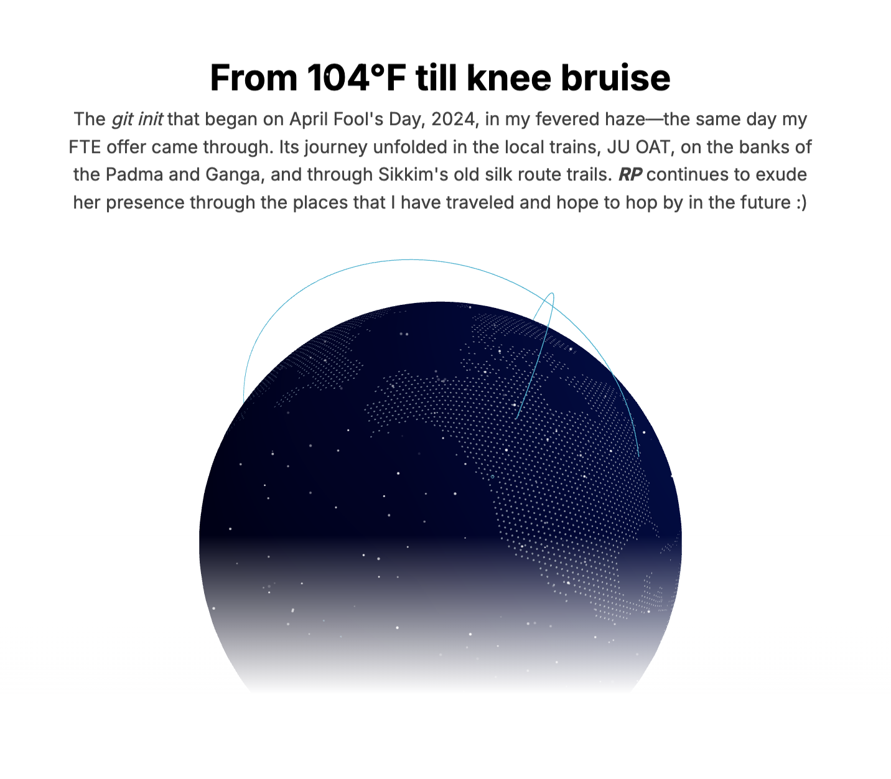
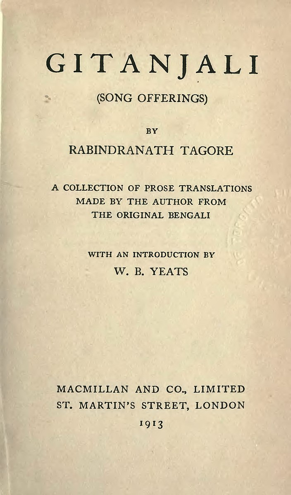
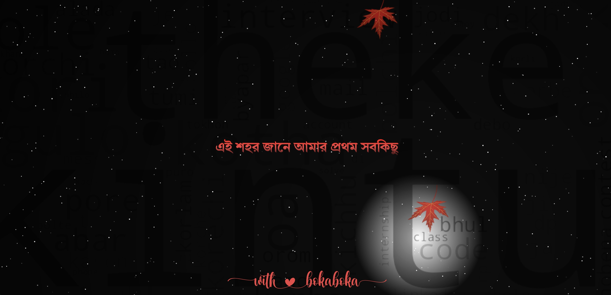

[](https://rimjhim.manaspratimbiswas.com/preface)

> _তুমি ক্রোধের আগুনে জমে থাকা ব্যাথা, <br> আমার শেষ বিকেলের ধোঁকা <br> কোন রোদেলা দুপুরে তোমায় ফিরে পাবো বলে <br> অর্থহীন খোঁজা_

[](https://rimjhim.manaspratimbiswas.com/redit)

_[Preface](https://rimjhim.sanam.live/preface)_
<br/>
_[In-house Redit](https://rimjhim.manaspratimbiswas.com/redit)_
<br/>
_[Take Me Home](https://rimjhim.sanam.live/)_

# Inspiration

I first encountered William Butler Yeats’ introduction to _Gitanjali_ when I was in eighth grade. I clearly remember, it was a rainy day, and I waded through waterlogged streets of quintessential North Calcutta to borrow a copy of Tagore's _Gitanjali_ from my local library. In Yeats’ words:



> _I have carried the manuscript of these translations about with me for days, reading it in railway trains, or on the tops of omnibuses and in restaurants, and I have often had to close it lest some stranger would see how much it moved me. These [lyrics](https://poets.org/glossary/lyric-poetry)—which are in the original, my Indians tell me, full of subtlety of rhythm, of untranslatable delicacies of colour, of [metrical](https://poets.org/glossary/meter) invention—display in their thought a world I have dreamed of all my life long. ~ William Butler Yeats, [Introduction to Gitanjali](https://poets.org/text/william-butler-yeatss-introduction-gitanjali)_

His reflection on the untranslatable emotions in the poems mirrored my own feelings, a world I had dreamed of for years.

# Background

_*RP*_ was born out of a moment of personal reflection to wish a birthday to someone very close to my heart, sparked on April Fool’s Day of 2024, when I was bedridden with fever. That same day, an unexpected on-campus offer arrived, marking a pivotal moment in my life. What started in that fevered haze has since developed across various places—the local trains of _Eastern Railways_, the quiet expanses of _Jadavpur University_ and the _Open Air Theatre_, the river banks of _Ganga_ and _Padma_, and the trials of the old silk route. Each location has left its mark as I developed newer ideas and added more features to this project, much like my own journey through love, wait, hope, despair, anger, and apathy.

This repository is more than just code; it is a memoir of emotions and experiences, etched in the places I have been and the ones I hope to visit. With ❤️ for love, I [document this journey](https://rimjhim.sanam.live/preface).

## Slime Mold Evolution Simulation

The [_algorithm_](src/components/Myxomycete.tsx) used for the [_simulation of mold behavior_](https://rimjhim.sanam.live/ilu) is inspired by the research paper titled "[_Characteristics of Pattern Formation and Evolution in Approximations of Physarum Transport Networks_](public/artl.2010.16.2.pdf)", which explores the pattern formation and evolution in Physarum transport networks.

## Word Cloud and Scripting

The [_Word Cloud_](public/wordcloud.png) used as a backdrop is born out of the chat between me and my beloved from a smaller prototype project called [_chatinfo_](https://github.com/sanam2405/chatinfo), where I scripted a [WhatsApp](https://www.whatsapp.com/) static textual analyzer in _Python_.

[](https://rimjhim.sanam.live/)

## Music Credits

<details>
  <summary>1. <i>পলাতকা প্লাবনের পরী প্রণয়নী </i> </summary>
  <br/>
  
    পলাতকা প্লাবনের পরী প্রণয়নী, 
    কিসের তালে নেচে উঠেছে ধমনী?
    পলাতকা প্লাবনের পরী প্রণয়নী, 
    কিসের তালে নেচে উঠেছে ধমনী?
    জানি বেঁকে গেছে নদী, তবুও তো নিরবধি, 
    মিছিলে-মিছিলে আমি খুঁজেছি তোমায়...

    কবিতায়, খালি পায়ে, সব খেলা ফেলে,
    ছুটেছি খুব, দেব ডুব, আমি ডানা মেলে,
    হায় কবিতায়, খালি পায়ে, সব খেলা ফেলে,
    ছুটেছি খুব, দেব ডুব, আমি ডানা মেলে,
    সবুজে-সাদাতে-লালে, কি সায়রে কি ডোবালে?
    শব্দের ডুবুরিরা চিনেছে তোমায়...

    অসহায়, মৃতপ্রায়, আহা কোনোমতে,
    তুমি আলোকিত, সজ্জিত, ছায়াপথে,
    হায়, অসহায়, মৃতপ্রায়, আহা কোনোমতে,
    তুমি আলোকিত, সজ্জিত, ছায়াপথে,
    গোপনে-গোপনে যতো শব্দেরা অবিরত,
    তোমাকেই ডাকে, তুমি শোনোনা বোধহয়...

</details>

- Lyrics: _Orchon Bhattacharya_
- Composition: _Wolfgang Amadeus Mozart_ (Symphony No. 25 in G minor)
- Vocals: _Sudhaborshy Chakraborty_ and _Chandosika_

<details>
  <summary>2. <i> শুধু তোমাকেই ভালোবেসে </i> </summary>
  <br/>
  
    শুধু তোমাকেই ভালোবেসে
    শুকনো নদীতে ডিঙি ভাসিয়েছি মোহনার কাছে এসে
    শুধু তোমাকেই ভালোবেসে
    দু'মুঠো আদর ভিক্ষে চেয়েছি দরিদ্র এই দেশে
    শুধু তোমাকেই ভালোবেসে
    ঝড়ের সামনে দাঁড়িয়েছি একা ছেঁড়া পতাকার বেশে
    তোমাকেই ভালোবেসে
    তোমাকেই ভালবাসবো ভেবেছি শত যুদ্ধের শেষে
    এই পাঁজরভরা ভালোবাসা দু'হাত ভরে নাও
    এই আধো আলো আধো ছায়া দু'চোখ ভরে নাও
    এই আমায় কিছু নাই বা দিলে নিজের করে নাও
</details>

- Lyrics & Composition: _Nilanjan Ghoshal_
- Vocals & Guitar: _Sudhaborshy Chakraborty_

<details>
  <summary>3. <i> গীতগোবিন্দ </i> </summary>
  <br/>

    তোমাকে দেখাবো Niagara
    তোমাকে শেখাবো Viagra
    তোমাকে করবো আদর-আত্তি जत्नम्
    ওগো त्वमसि मम जीवनम्
    त्वमसि मम भूषणम्
    त्वमसि मम भवजलधिरत्नम्

    তোমাকে শোনাবো জয় গোঁসাই
    তোমার বাবাকে মেসোমশাই
    পুচ্ছে বেঁধেছি গুচ্ছ রজনীগন্ধা
    আজি এ পরানে রবির কর
    কেমনে জাগালো dinosaur
    হাউমাউ বেগে দেখি पिया मुख चंदा

    দারুণ কাটলে ছোট্ট চুল
    বোতাম আঁটতে করছো ভুল
    সরু সংসারে কেমনে ফুটিলে उदारम्
    स्मर गरल खण्डनम्
    मम शिरसि मण्डनम्
    देहि पद पल्लवम् उदारम्

    তোমার জন্যে চিন্তা হয়
    তুমি তো Preity Zinta নয়
    টুপুর টাপুর Kareena Kapoor চেষ্টা
    তবু তুমি আমার CPM,
    তুমি আমার ATM,
    তুমিই আমার series প্রেমের শেষটা

    খাচ্ছি, কিন্তু গিলছি কই
    পাখার রাজ্যে চুল শুকোই
    টাকের মধ্যে পেরজাপতি ফড়-ফড়িং
    সোনা বড্ড বেশি ঝলমলাও
    Lift-এ ওঠো একতলায়
    Beetles ছাড়া অন্য পোকা খুব boring

    তুমি শ্যামলা বঙ্গদেশ, তুমি ইঙ্গো SMS
    তুমি অং-বং ভবজলধি নুলিয়া আ...
    বধূ চোক্ষে এসো, অন্ধ হোক
    কক্ষে এসো নিন্দে হোক
    বক্ষে এসো গীতগোবিন্দ ভুলিয়া

</details>

- Lyrics: _Chandril Bhattacharya_
- Composition: _Chandrabindoo_ (Juju)

<details>
  <summary>4. <i> ধাঁধার থেকেও জটিল তুমি </i> </summary>
  <br/>

    ধাঁধার থেকেও জটিল তুমি
    খিদের থেকেও স্পষ্ট।
    কাজের মধ্যে অকাজ খালি
    মনের মধ্যে কষ্ট।

    স্বপ্ন হয়ে যখন তখন আঁকড়ে আমায় ধর
    তাইতো বলি আমায় বরং
    ঘেন্না কর ঘেন্না কর।

    গুনগানের হাজার বুলি, শুধুই সময় নষ্ট
    আঁকছো ছবি সমস্ত দিন, রঙ সবই অস্পষ্ট।
    সুখের থেকেও হাজার গুনে দুঃখ অনেক ভালো
    তাইতো বলি আমায় বরং
    ঘেন্না কর ঘেন্না কর।

    আজ চালাক আমি কাল বোকা
    মহৎ প্রেমিক ন্যাকা ন্যাকা,
    আজ চালাক আমি কাল বোকা
    মহৎ প্রেমিক ন্যাকা ন্যাকা
    আমার আসল চেহারা কি চিনতে তুমি পারো?
    চিনতে যদি পেরেই থাকো
    ঘেন্না কর ঘেন্না কর।

    ধাঁধার থেকেও জটিল তুমি
    খিদের থেকেও স্পষ্ট।
    কাজের মধ্যে অকাজ খালি
    মনের মধ্যে কষ্ট।
    স্বপ্ন হয়ে যখন তখন আঁকড়ে আমায় ধর
    তাইতো বলি আমায় বরং
    ঘেন্না কর ঘেন্না কর।

</details>

- Lyrics: _Joyjit Lahiri_
- Composition: _Subrata Ghosh_
- Band: _Gorer Math_
- First released as part of _Mohiner Ghoraguli Sompadito_ (Compilation) Albums
- Rendition:

  - Dotara - _Shayan Sinha_
  - Vocals & Ukulele - _Sayatya_

- **NOTE** that this is not a song by Mohiner Ghoraguli but released as part of Mohiner Ghoraguli Sompadito Albums

<details>
  <summary>5. <i> প্রস্তাব </i> </summary>
  <br/>

    গুনে গুনে দেখি অবেলার স্বপ্নটায়
    আঁকা ছিলো কত শত কবিতায়,
    স্বপ্নের সেই কবিতার ছন্দতে
    মিশে ছিলো তার হাসিমাখা ছবিটা
    যা আঁকা ছিলো অদ্ভুত রঙ তুলি
    যা জমা থাকে আমার মনে মাঝে।
    বর হয়ে আমি চড়ছি ঘোড়ায়,
    আড়ালে তুমি লুকিয়ে আছো বৌ সাজে।

    আমার এই স্বপ্ন কি শুধু,
    স্বপ্ন হয়ে হাসাবে আমায়,
    তেমন সাহস নেই আমার
    তোমাকে কিভাবে প্রস্তাব জানাই?

    সেই কল্পনায় আঁকা আল্পনায়
    তোমায় নিয়ে ভাবা শত জল্পনায়।
    তুমি আছো বলে বেঁচে আছে স্বপ্নটা,
    তোমায় নিয়ে লেখা এই কবিতা।
    সেই কবিতার ছন্দটা তুমি,
    মিশে থাকা প্রতি অক্ষরে আমি।
    জানা নেই কি হতে পারে শেষটা,
    নিশ্চুপ কবি বসে লিখছে কবিতায়।

    আমার এই স্বপ্ন কি শুধু,
    স্বপ্ন হয়ে হাসাবে আমায়,
    তেমন সাহস নেই আমার
    তোমাকে কিভাবে প্রস্তাব জানাই?

</details>

- Lyrics: _Moontasir Rakib_
- Composition: _Odd Signature_

<details>
  <summary>6. <i> সে যে বসে আছে একা একা </i> </summary>
  <br/>

    সে যে বসে আছে একা একা
    রঙিন স্বপ্ন তার বুনতে,
    সে যে চেয়ে আছে ভরা চোখে
    জানালার ফাঁকে মেঘ ধরতে।
    সে যে বসে আছে একা একা
    রঙিন স্বপ্ন তার বুনতে,
    সে যে চেয়ে আছে ভরা চোখে
    জানালার ফাঁকে মেঘ ধরতে।

    তার গুনগুন মনের গান বাতাসে উড়ে
    কান পাতো মনে পাবে শুনতে,
    তার রঙের তুলির নাচে মেঘেরা ছুটে
    চোখ মেল যদি পারো বুঝতে।
    তার গুনগুন মনের গান বাতাসে উড়ে
    কান পাতো মনে পাবে শুনতে,
    তার রঙের তুলির নাচে মেঘেরা ছুটে
    চোখ মেল যদি পারো বুঝতে।।

    সে যে বসে আছে একা একা
    তার স্বপ্নের কারখানা চলছে,
    আর বুড়ো বুড়ো মেঘেদের দল
    বৃষ্টি নামার তাল গুনছে।
    সে যে বসে আছে একা একা
    তার স্বপ্নের কারখানা চলছে,
    আর বুড়ো বুড়ো মেঘেদের দল
    বৃষ্টি নামার তাল গুনছে।

    সেই গুন গুন মনের গান বৃষ্টি নামায়
    টপটপ ফোটা পড়ে অনেকক্ষণ,
    সেই বৃষ্টি ভেজা মনে ডাক দিয়েছে
    ভেজা কাক হয়ে থাক আমার মন।
    সেই গুন গুন মনের গান বৃষ্টি নামায়
    টপটপ ফোটা পড়ে অনেকক্ষণ,
    সেই বৃষ্টি ভেজা মনে ডাক দিয়েছে
    ভেজা কাক হয়ে থাক আমার মন।

    সে যে বসে আছে, সে যে বসে আছে...

</details>

- Lyrics: _Shayan Chowdhury Arnob_
- Composition: _Shayan Chowdhury Arnob_ (Chaina Bhabish)
- Rendition: _Arijit Singh_

<details>
  <summary>7. <i> ओ सनम </i> </summary>
  <br/>

    शाम-सवेरे तेरी यादें आती हैं
    आ के दिल को मेरे यूँ तड़पाती हैं
    ओ सनम, मोहब्बत की क़सम
    मिल के बिछड़ना तो दस्तूर हो गया
    यादों में तेरी मजबूर हो गया
    ओ सनम, इन यादों की कसम
    समझे ज़माना के दिल है खिलौना
    जाना है अब "क्या है दिल का लगाना"
    नज़रों से अब ना हम को गिराना
    मर भी गए तो भूल ना जाना
    आँखों में बसी हो पर दूर हो कहीं
    दिल के करीब हो, ये मुझ को है यकीं
    ओ सनम, तेरे प्यार की कसम

</details>

- Lyrics: _Syed Aslam Noor_
- Composition & Vocals: _Lucky Ali_ (Sunoh)
- Writing & Recitation : _Manas_

<details>
  <summary>8. <i> যারা কাফেতে মোড়েতে বসে আছো </i> </summary>
  <br/>

    যারা কাফেতে মোড়েতে বসে আছো
    আমি তোমাদের ছেড়ে চললাম
    তোমরা হতাশ-পেয়ালা ভরে নিলে
    আমি রক্ত ঝরিয়ে কাঁদলাম ।
    চারমিনারের ধোঁয়াতে
    জীবন-পেয়ালা জমাট কুয়াশা
    ফ্লুরেসেন্ট আলোর মোড়ে মোড়ে ঘোরে
    তৃষিত মুক্তিপিপাসা ।
    আজ ভেঙ্গে যাব, কাল জুড়ে যাব
    তবু ভাঙ্গতে জুড়তে চলেছি
    কালবোশেখিটা তোমাদের দেব
    খুঁজে আনতেই চলেছি।
    ওগো হতাশ তোমরা কেঁদো না
    কোনো সান্ত্বনা আমি দেব না
    সূর্য ডোবার সংকেতে দেখ
    মুক্তিরঙ্গের নিশানা ।
    সাহারা হৃদয় দাঁড়িয়ে যারা
    মোড়ে মোড়ে আজও হতাশায়
    আমার রক্ত ঝরে ঝরে যাক
    তাদের শূন্য পেয়ালায় ।
    আজ ভেঙ্গে যাব, কাল জুড়ে যাব
    তবু ভাঙ্গতে জুড়তে চলেছি
    বিদ্রোহী আমি বিপ্লবে ডাক
    তোমাদের দিতে এসেছি ।

</details>

- Lyrics & Composition: _Samaresh Bandyopadhyay & Snigdha Bandyopadhyay_ (Calcutta People's Choir & Ganabishan)
- Vocals: _Shuvro Deb_

<details>
  <summary>9. <i> প্রথম সবকিছু </i> </summary>
  <br/>

    প্রথম স্কুলে যাবার দিন, প্রথমবার ফেল
    প্রথম ছুটি হাওড়া থেকে ছেলেবেলার রেল
    প্রথম খেলা লেকের মাঠে প্রথম ফুটবল
    মান্না, পিকে, চুনীর ছবি, বিরাট সম্বল

    প্রথম শেখা ইমন রাগ, প্রথম ঝাঁপতাল
    প্রথম দেখা শহরজোড়া বিরাট হরতাল
    প্রথমবার লুকিয়ে টানা প্রথম সিগারেট
    প্রথমবার নিজামে গিয়ে কাবাব ভরপেট

    এই শহর জানে আমার প্রথম সবকিছু
    পালাতে চাই যত, সে আসে আমার পিছু পিছু

    প্রথম প্রেমে পড়ার পর সবাই পস্তায়
    হন্যে হয়ে ক্লাস পালিয়ে ঘুরেছি রাস্তায়
    প্রথম প্রেম ঘুচে যাওয়ার যন্ত্রণাকে নিয়ে
    কান্না চেপে ঘুরেছিলাম তোমারই পথ দিয়ে

    এই শহর জানে আমার প্রথম সবকিছু
    পালাতে চাই যত, সে আসে আমার পিছু পিছু

    প্রথম দেখা লাল নিশান, মিছিল কলতান
    প্রথম শোনা জনসভায় হেই সামালো ধান
    প্রথম দেখা তরুণ লাশ চলছে ভেসে ভেসে
    দিনবদল করতে গিয়ে শহীদ হল শেষে

    প্রথম দেখা ভিখারিনীর কোলে শহীদ শিশু
    প্রথম দেখা আস্তাকুঁড়ে কলকাতার যীশু
    প্রথম দেখা দিন-দুপুরে পুলিশ ঘুষ খায়
    প্রথম জানা পয়সা দিয়ে সবই কেনা যায়

    এই শহর জানে আমার প্রথম সবকিছু
    পালাতে চাই যত, সে আসে আমার পিছু পিছু

    প্রথম যৌবনের শেষে মাঝ বয়েসে আসা
    গিটার নিয়ে গান ধরেছে আমার ভালোবাসা
    প্রথম যৌবনের শেষে মাঝ বয়েসে আসা
    গিটার নিয়ে গান ধরেছে আমার ভালোবাসা
    লজ্জা ঘৃণা রাগের পরে এটাও বুঝি থাকে
    এটাই দিবো তোমায় আর এই শহরটাকে

</details>

- Lyrics: _Kabir Suman_
- Composition & Vocals: _Kabir Suman_ (Gaanola)

<details>
  <summary>10. <i> মোহ </i> </summary>
  <br/>

      তুমি ক্রোধের আগুনে জমে থাকা ব্যাথা
      আমার শেষ বিকেলের ধোঁকা
      কোন রোদেলা দুপুরে
      তোমায় ফিরে পাবো বলে অর্থহীন খোঁজা

      আমি আঁকিনি তোমার ছবি
      দেখিনি স্রোতের নদী
      আকাশ ভরা তারা
      যত সুখের স্মৃতি ঘিরে আছো তুমি মেয়ে
      এ পথের শেষ কোথা?

      ছেঁড়া পালের গহীনে লাগিয়ে ঝড়ো হাওয়া
      তুমি ভাসাও সুরের ভেলা
      তবু কাঁদো কেনো বসে একা নির্জনে
      ভুলে যাও তুমি বাস্তবতা?

      আমি পাইনি তোমার ছোঁয়া
      শিশির মাখানো ধোঁয়া জলের নিস্তব্ধতা
      আজও চাঁদ ডুবে গেলে তোমায় মনে পরে
      সঙ্গী মোর নিঃসঙ্গতা

      কখন থামবে কোলাহল জানিনা
      সময় কাঁদে বন্দী হয়ে
      বুকের পাঁজরে জমাট বেদনায়
      আলোর মশাল জ্বালি নীরবে

      তুমি আবার আসবে কখন কোথায়?
      গুনবে তারা আমার সাথে
      বুকের যন্ত্রনা নিভিয়ে দিয়ে
      গাইবে তুমি বৃষ্টির সুরে

      আমি আঁকিনি তোমার ছবি
      দেখিনি স্রোতের নদী
      পাইনি তোমার ছোঁয়া
      শিশির মাখানো ধোঁয়া

      আমি আঁকিনি তোমার ছবি
      দেখিনি স্রোতের নদী
      আকাশ ভরা তারা
      যত সুখের স্মৃতি ঘিরে
      আছো তুমি মেয়ে
      এ পথের শেষ কোথা?

</details>

- Composition: _Aftermath_
- Band: _Aftermath_

<details>
  <summary>11. <i> Jutti Meri </i> </summary>
  <br/>

    Jutti meri jaandi hai pahadiye de naal
    (Neither my shoe will go with the mountain boy)
    Te paula mere jaanda e uss dogre de naal
    (Nor my sandal will go with the dogra)

    Pehli pehli vaar mennu saura lene aa gaya
    (First came my father-in-law to take me home)
    Saura lein aagaya te vanga pawa gaya
    (My father-in-law came with bangles to woo me)

    Wanga te paanian hatthe de naal
    Te paula mara jaanda uss dogre de naal
    (I will wear the bangles in my hand
    but my sandle is not going anywhere with the dogra)

    Dooji dooji var menu 'Der' lene aagya
    (The second time around, my brother-in-law came to take me home)
    'Der' lene aagya teh legenga pawa gaya
    (My brother-in-law came to take me home, and to woo me he got a beautiful lehenga)

    Lehenga te paanian lakke de naal
    Te paula mere jaanda uss dogre de naal
    (I will wear the lehenga on my waist
    but my sandle is not going anywhere with the dogra)

    Teeji teeji vaar menu aap lene aa gaya,
    (The third time, my husband came to take me home)
    Aap lene aagaya do galla sunagaya
    (Finally, he came and scolded me for being too stubborn)
    Thumak thumak jaandi ae a maiye de naal
    (Dancing and swaying I go along with my husband)
    Thumak thumak jaandi ae a maiye de naal
    (Dancing and swaying I go along with my husband)

    Sona mera maahi tur jaana ode naal
    (I happily go with my handsome husband)
    Sona mera maahi tur jaana ode naal
    (I happily go with my handsome husband)

    Thumak thumak jaandi ae a maiye de naal
    (Dancing and swaying I go along with my husband)
    Thumak thumak jaandi ae a maiye de naal
    (Dancing and swaying I go along with my husband)

</details>

<br/>

Jutti Meri is a fun _Punjabi/Dogra_ folk song, depicting the feelings of a new bride who is being playful about not going back to her husband's house.

- Lyrics: _Panjabi/Dogra Folklore_
- Composition: _Sameer Uddin_ (Folk Tales)
- Lead Vocalist: _Neha Bhasin_
- Backing Vocals: _Ananya Purkayastha & Rashi Bagai_
- Guitar: Sanjoy Das / Sameer Uddin
- Bouzouki: Prasant Singh
- Percussion: Abhishek Arora
- Piano: Natasha Pinto

## Setting up locally

- Clone the rp repository

```bash
    git clone git@github.com:sanam2405/rp.git
    cd rp
```

- Install the dependencies

```bash
    pnpm install
```

- Build the project

```bash
   pnpm build
```

- Start the project

```bash
   pnpm start
```

- For local development, start a _[turbopack development server](https://turbo.build/pack/docs/features/dev-server)_

```bash
   pnpm dev
```

- Running with Docker

```bash
   docker compose up
```

## _with_ ♥️ _for love by sanam_

> _জানি বেঁকে গেছে নদী, তবুও তো নিরবধি, <br> মিছিলে-মিছিলে আমি খুঁজেছি তোমায়।_

- [Manas Pratim Biswas](https://www.linkedin.com/in/manas-pratim-biswas)
